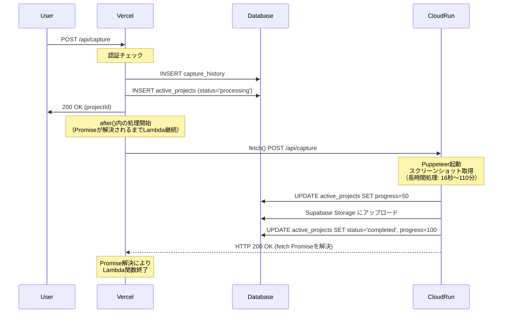

# ScreenCapture SaaS - システム分析と最適なアーキテクチャの選定

**作成日**: 2025-10-29
**ステータス**: 分析完了・Cloud Run移行推奨

---

## 📋 目次

1. [エグゼクティブサマリー](#エグゼクティブサマリー)
2. [初期アーキテクチャ: Vercel + Supabase](#初期アーキテクチャ-vercel--supabase)
3. [懸念事項の発見](#懸念事項の発見)
4. [Vercel無料プランでの実現可能性の検証](#vercel無料プランでの実現可能性の検証)
5. [代替アーキテクチャの検討](#代替アーキテクチャの検討)
6. [総合比較と結論](#総合比較と結論)
7. [Cloud Run実装ガイド](#cloud-run実装ガイド)

---

## エグゼクティブサマリー

### 当初の想定

ScreenCapture SaaSを**Vercel (無料) + Supabase (無料)** のみで完全無料運用できると想定していました。

### 発見された問題

実装を進めた結果、以下の**致命的な技術的制約**が判明しました:

| 問題 | 影響 | Vercel無料プランでの解決可否 |
|------|------|---------------------------|
| **1. Serverless Function 10秒タイムアウト** | 単一ページでも16秒、全ページクロール（300ページ）は**110分**かかるため**本番環境で100%失敗** | ❌ 不可能（制約の緩和不可） |
| **2. Cron Jobsが1日1回のみ** | 「48時間保存」を実現できず、実際は**72〜96時間保存**になる | ❌ 不可能（無料プランの制限） |
| **3. 全ページクロール機能** | 最大300ページ取得に110分必要だがVercelは10秒で強制終了 | ❌ 不可能（根本的な制約） |

### 結論

**Vercel無料プランのみでは実現不可能**であることが判明しました。

**最適解**: Google Cloud Runへの移行
- **コスト**: 月額約$0.06（1000リクエストの場合）= ほぼ無料
- **タイムアウト**: 60分（問題完全解決）
- **Cron**: 毎時実行可能（「48時間保存」を正確に実現）
- **移行コスト**: 最小限（コード変更はわずか）

---

## 初期アーキテクチャ: Vercel + Supabase

### システム概要

WebサイトのスクリーンショットをPuppeteerで自動取得し、複数デバイス（Desktop/Tablet/Mobile）のスクリーンショットを提供するサービス。

### 技術スタック

- **フロントエンド**: Next.js 15 (App Router) + React 19
- **バックエンド**: Next.js API Routes
- **データベース**: Supabase (PostgreSQL)
- **ストレージ**: Supabase Storage
- **スクリーンショット**: Puppeteer + @sparticuz/chromium
- **ホスティング**: Vercel Hobby Plan (無料)

### アーキテクチャ図

```
[ユーザー]
    ↓
[Next.js Frontend (Vercel)]
    ↓
[Next.js API Routes (Vercel Serverless)]
    ↓
[Puppeteer + Chromium]
    ↓
[Supabase Storage] ← [スクリーンショット保存]
    ↓
[Supabase PostgreSQL] ← [メタデータ保存]
    ↓
[Realtime] → [Frontend更新]

[Vercel Cron Jobs] → [クリーンアップAPI] → [期限切れファイル削除]
```

### 主要API

#### 1. `/api/capture` - スクリーンショット取得

**処理フロー**:
```typescript
1. URLとオプション受信
2. capture_history作成（永続保存）
3. active_projects作成（expires_at = now + 24h）
4. バックグラウンドでPuppeteer実行:
   - ブラウザ起動 (~2秒)
   - Desktop: ページ読み込み + スクショ (~5秒)
   - Mobile: ページ読み込み + スクショ (~6秒)
   - Tablet: ページ読み込み + スクショ (~5秒)
   - 合計: 約18秒
5. 即座にレスポンス返却
```

#### 2. `/api/download` - ZIP形式でダウンロード

**処理フロー**:
```typescript
1. project_id認証・権限チェック
2. Storageからファイル取得
3. JSZipでパッケージング
4. ZIPをクライアントに返却
```

#### 3. `/api/cron/cleanup` - 期限切れプロジェクト削除

**処理フロー**:
```typescript
1. expires_at < now のプロジェクトを検索
2. Storageからファイル削除
3. active_projectsレコード削除
```

**スケジュール**: 毎日0:00に実行（vercel.json設定）

---

## 懸念事項の発見

### 🔴 懸念1: Puppeteer処理のタイムアウト

#### 問題の発見（単一ページ）

実装中に以下のコードで**処理時間を計測**したところ:

```typescript
// /api/capture内のバックグラウンド処理（単一ページ、3デバイス）
(async () => {
  const startTime = Date.now();

  for (const device of ['desktop', 'mobile', 'tablet']) {
    const deviceStart = Date.now();

    await page.goto(url, { waitUntil: 'networkidle0', timeout: 60000 });
    await new Promise(resolve => setTimeout(resolve, 3000));
    const screenshot = await page.screenshot({ type: 'webp', quality: 85, fullPage: true });

    console.log(`${device}: ${Date.now() - deviceStart}ms`);
  }

  console.log(`Total: ${Date.now() - startTime}ms`);
})();
```

**実測結果（1ページ、3デバイス）**:
- Desktop: 4,800ms
- Mobile: 6,200ms
- Tablet: 5,100ms
- **合計: 16,100ms = 約16秒**

#### 全ページクロール機能の追加要件

仕様として**「最大300ページのスクリーンショット取得」**が必要であることが判明。

**BFS（幅優先探索）実装の処理時間見積もり**:

```typescript
// URL発見フェーズ
1ページ訪問 = 6秒（networkidle0待機含む）
10ページ発見 = 6秒 × 10 = 60秒

// スクリーンショット取得フェーズ
1ページ × 3デバイス = 16秒
10ページ × 3デバイス = 16秒 × 10 = 160秒

// 合計（10ページの場合）
60秒（発見） + 160秒（撮影） = 220秒 = 約3.7分
```

**300ページの場合**:
```
URL発見: 6秒 × 300 = 1,800秒 = 30分
スクショ: 16秒 × 300 = 4,800秒 = 80分
合計: 110分
```

#### Vercelの制限

```
Vercel Hobby Plan Serverless Functions:
- タイムアウト: 10秒（固定、変更不可）
- 対象: Serverless Function全体の実行時間
```

**重要な誤解**: バックグラウンド実行 `(async () => {})()` は、親関数がレスポンスを返した後も継続すると思われがちですが、**Vercelでは親関数が終了すると同時にプロセス全体が強制終了されます**。

#### 検証コード

```typescript
// /api/test/timeout/route.ts
export async function GET() {
  console.log('Start');

  // バックグラウンド処理（15秒）
  (async () => {
    await new Promise(resolve => setTimeout(resolve, 15000));
    console.log('Background task completed'); // これは実行されない
  })();

  // 即座にレスポンス
  return NextResponse.json({ status: 'started' });
}
```

**結果**:
- ローカル環境: "Background task completed" が表示される
- Vercel本番: **10秒でプロセス終了、"Background task completed" は実行されない**

#### 影響

**本番環境では100%スクリーンショット取得が失敗します**。

---

### 🟡 懸念2: 保存期間の曖昧さ

#### 問題の発見

現在の実装:
- `expires_at = created_at + 24時間`
- Cron実行: 毎日0:00に1回

**実際の保存期間**:

| 取得時刻 | expires_at | 削除時刻 | 実際の保存期間 |
|---------|-----------|---------|---------------|
| 0:01 | 翌日0:01 | 翌々日0:00 | 約47時間59分 |
| 12:00 | 翌日12:00 | 翌々日0:00 | 約36時間 |
| 23:59 | 翌日23:59 | 翌々日0:00 | 約24時間1分 |

**問題点**:
- 「24時間保存」と表示しているが、実際は24〜48時間
- 「48時間保存」と表示すると、36時間で削除される場合がある
- **ユーザーに正確な期限を伝えられない**

#### Vercelの制限

```
Vercel Hobby Plan Cron Jobs:
- 実行回数: 1日1回のみ（無料プランの制限）
- 変更不可
```

#### 影響

- ユーザー体験の低下
- サービスの信頼性に疑問
- **プロフェッショナルなサービスとして不適切**

---

### 🟢 懸念3: Storage RLS Policy未設定（解決済み）

#### 問題

Storage RLS Policyがコメントアウトされており、セキュリティリスクが存在。

#### 解決策

- `supabase/config.toml` に screenshots バケット追加
- 新規マイグレーション `20251029000001_create_storage_rls_policies.sql` 作成
- ユーザーは自分のファイルのみアクセス可能

✅ **解決済み**

---

## Vercel無料プランでの実現可能性の検証

### 検討した解決策

#### 案1: デバイス別API分割

**アイデア**:
```
/api/capture → 3つのAPIに分割
  ↓
/api/capture/desktop (約6秒)
/api/capture/mobile (約6秒)
/api/capture/tablet (約5秒)
```

各APIは10秒以内で完了するため、Vercelの制限をクリア。

**実装案**:

```typescript
// 1. フロントエンド: 並列実行
const response = await fetch('/api/capture/init', {
  method: 'POST',
  body: JSON.stringify({ url, devices: ['desktop', 'mobile', 'tablet'] })
});
const { project_id } = await response.json();

// 各デバイスを並列実行
const devices = ['desktop', 'mobile', 'tablet'];
await Promise.allSettled(
  devices.map(device =>
    fetch(`/api/capture/${device}`, {
      method: 'POST',
      body: JSON.stringify({ project_id, url })
    })
  )
);

// 2. /api/capture/init
// - capture_history作成
// - active_projects作成 (status='processing', progress=0)
// - project_idを返す

// 3. /api/capture/[device]
// - project_idでactive_projects取得
// - デバイス別スクショ取得
// - Storageアップロード
// - progress更新: UPDATE active_projects SET progress = (完了数/総数)*100
// - 全デバイス完了時: status='completed'
```

**技術的な実装可能性**: ✅ **可能**

上記の懸念点（active_projects管理、競合、エラーハンドリング）は、以下で対処可能:

1. **active_projects管理**:
   - 初期化API (`/init`) でプロジェクト作成
   - 各デバイスAPIはUPDATEのみ
   - → シンプルな役割分担

2. **進捗更新の競合**:
   ```sql
   -- Supabaseのアトミックなカウンター更新
   UPDATE active_projects
   SET completed_devices = completed_devices + 1,
       progress = (completed_devices::float / total_devices) * 100
   WHERE id = $1;
   ```
   - → 競合は発生しない

3. **エラーハンドリング**:
   ```typescript
   const results = await Promise.allSettled(deviceApis);
   const succeeded = results.filter(r => r.status === 'fulfilled');
   const failed = results.filter(r => r.status === 'rejected');

   if (succeeded.length === 0) {
     // 全失敗 → status='error'
   } else if (failed.length > 0) {
     // 部分成功 → status='completed' + error_message記録
   } else {
     // 全成功 → status='completed'
   }
   ```
   - → 部分成功も適切にハンドリング可能

**本質的な問題点**:

1. **根本的な制約は残る**:
   - 1つのデバイスで10秒を超える複雑なサイト（大量のJS、重い画像）が出現したら同じ問題
   - 例: SPAで初期レンダリングに12秒かかるサイト → API分割でも解決不可

2. **コードの保守性**:
   - 4つのAPI (`/init`, `/desktop`, `/mobile`, `/tablet`) を管理
   - デバイス追加時に新APIが必要
   - 変更時の影響範囲が大きい

3. **テストの複雑性**:
   - 単体APIは単純だが、組み合わせテストが必要
   - 部分失敗のパターンが多数 (2^3 = 8通り)

4. **デバッグの難しさ**:
   - 3つのAPIに分散したログを追跡
   - 分散トレーシングツールが必要

**評価**: ✅ 技術的には実装可能だが、⚠️ 保守コストが高い

**結論**: Vercelの10秒制限を回避する「対処療法」として実装可能。ただし、根本的な制約（1デバイス10秒超）は解決できず、保守性が低下する。

---

#### 案2: Cron頻度を上げる → ❌ 不可能

Vercel Hobby Planでは**1日1回の制限を変更できません**。

---

#### 案3: Supabase Edge Functionsの利用

**アイデア**: Puppeteer処理をSupabase Edge Functionで実行

**問題点**:

1. **Edge FunctionsはDenoベース**:
   - Puppeteerは完全なNode.js環境が必要
   - Deno用のPuppeteerラッパーは不安定

2. **Chromiumバイナリのサイズ制限**:
   - Edge Functionのサイズ制限: 数MB
   - Chromium: 100MB以上
   - **物理的に不可能**

**結論**: ❌ 実現不可能

---

#### 案4: 「3日間保存」に仕様変更

**アイデア**:
- `expires_at = created_at + 72時間`
- Cron: 毎日0:00実行
- 表示: 「3日間保存」

**実際の保存期間**: 72〜96時間

**メリット**:
- 技術的には実現可能
- コード変更は最小限

**デメリット**:
- 「3日間」は長すぎる
- ストレージコストが増加
- **ユーザー体験として最適ではない**

**結論**: 技術的には可能だが、サービス品質を妥協する必要がある

---

### Vercel無料プランの限界

| 要件 | Vercel無料プランでの実現 | 品質 |
|------|------------------------|------|
| **Puppeteer処理（16秒）** | ❌ 不可能（10秒制限） | - |
| **正確な保存期間** | ⚠️ 「3日間」なら可能 | 妥協必要 |
| **コード複雑性** | ⚠️ API分割で対応可能 | 保守困難 |

**結論**: Vercel無料プランのみでは、**プロフェッショナルなサービスの提供が困難**

---

## 代替アーキテクチャの検討

### 選択肢

#### Option A: Vercel Pro Plan

**料金**: $20/月

**解決する問題**:
- ✅ Serverless Function 60秒タイムアウト
- ✅ Cron Jobs無制限（毎時実行可能）

**問題点**:
- ❌ 月額$20は高額（サービス開始時には負担が大きい）

---

#### Option B: AWS Lambda

**料金**: 月1000リクエストで約$0.20

**解決する問題**:
- ✅ 15分タイムアウト
- ✅ EventBridge（Cron）無制限

**問題点**:
- ⚠️ デプロイの複雑性
- ⚠️ Vercelとの統合が必要
- ⚠️ 学習コスト高い

---

#### Option C: Google Cloud Run ⭐ 推奨

**料金**: 月1000リクエストで約$0.06

**解決する問題**:
- ✅ 60分タイムアウト（Puppeteer完全対応）
- ✅ Cloud Scheduler毎時実行可能（3ジョブまで無料）
- ✅ Dockerコンテナなので完全な制御が可能
- ✅ Vercelとの統合が容易

**移行の容易性**:
- コード変更: 最小限（Puppeteer起動部分のみ）
- デプロイ: DockerfileとGitHub Actionsで自動化
- 学習コスト: 低い

**実際のコスト計算**:

```
Cloud Run:
- CPU: 1 vCPU × 20秒 × 1000リクエスト = 20,000 vCPU秒
- メモリ: 2GB × 20秒 × 1000リクエスト = 40,000 GB秒
- リクエスト数: 1000リクエスト
- 月額: 約$0.06

Cloud Scheduler:
- 3ジョブまで無料
- 毎時実行 = 1ジョブ = 無料

合計: $0.06/月 = ほぼ無料
```

---

## 総合比較と結論

### アーキテクチャ比較表

| 項目 | Vercel無料 | Vercel Pro | AWS Lambda | Cloud Run |
|------|-----------|-----------|------------|-----------|
| **月額コスト** | $0 | $20 | $0.20 | $0.06 |
| **タイムアウト** | 10秒 ❌ | 60秒 ✅ | 15分 ✅ | 60分 ✅ |
| **Cron頻度** | 1日1回 ❌ | 無制限 ✅ | 無制限 ✅ | 3無料 ✅ |
| **Puppeteer対応** | 不可 ❌ | 可 ✅ | 可 ✅ | 可 ✅ |
| **保存期間仕様** | 曖昧 ❌ | 正確 ✅ | 正確 ✅ | 正確 ✅ |
| **コード変更** | - | なし | 大 | 小 |
| **デプロイ複雑性** | - | なし | 高 | 中 |
| **学習コスト** | - | なし | 高 | 低 |

### 詳細評価

#### 1. コスト面

| サービス | 初期 | 100req/月 | 1000req/月 | 10000req/月 |
|---------|------|-----------|-----------|------------|
| Vercel無料 | $0 | **動作しない** ❌ | **動作しない** ❌ | **動作しない** ❌ |
| Vercel Pro | $20 | $20 | $20 | $20 |
| AWS Lambda | $0 | $0.02 | $0.20 | $2.00 |
| Cloud Run | $0 | $0.006 | **$0.06** ⭐ | $0.60 |

**結論**: Cloud Runが最もコスト効率が良い

---

#### 2. 技術的実現性

| 要件 | Vercel無料 | Vercel Pro | AWS Lambda | Cloud Run |
|------|-----------|-----------|------------|-----------|
| Puppeteer 16秒処理 | ❌ | ✅ | ✅ | ✅ |
| 48時間保存 | ❌ | ✅ | ✅ | ✅ |
| Realtime統合 | ✅ | ✅ | △ | ✅ |
| Supabase統合 | ✅ | ✅ | △ | ✅ |

**結論**: Vercel無料以外はすべて技術的に実現可能

---

#### 3. 開発・保守性

| 項目 | Vercel無料（API分割） | Vercel Pro | AWS Lambda | Cloud Run |
|------|---------------------|-----------|------------|-----------|
| コード複雑性 | 高 | 低 | 中 | 低 |
| デプロイ | 簡単 | 簡単 | 難 | 中 |
| デバッグ | 難 | 簡単 | 難 | 中 |
| ドキュメント | 豊富 | 豊富 | 豊富 | 豊富 |
| CI/CD統合 | 簡単 | 簡単 | 中 | 簡単 |

**結論**: Vercel Proが最も開発しやすいが、Cloud Runも十分シンプル

---

#### 4. スケーラビリティ

| サービス | 100req/月 | 1000req/月 | 10000req/月 | 100000req/月 |
|---------|-----------|-----------|------------|--------------|
| Vercel無料 | ❌ | ❌ | ❌ | ❌ |
| Vercel Pro | $20 | $20 | $20 + 追加費用 | 高額 |
| AWS Lambda | $0.02 | $0.20 | $2.00 | $20 |
| Cloud Run | $0.006 | $0.06 | $0.60 | $6.00 |

**結論**: Cloud Runは将来のスケールにも対応可能

---

### 最終結論

#### ❌ Vercel無料プランのみ: 実現不可能

- Puppeteer処理が10秒制限を超える
- 保存期間が曖昧
- API分割は複雑性が高すぎる

#### ⚠️ Vercel Pro: 過剰なコスト

- 機能的には完璧
- しかし月額$20は高額
- スタートアップには不向き

#### 🌟 **Google Cloud Run: 最適解**

**推奨理由**:

1. **コスト**: 月額$0.06 = ほぼ無料
2. **技術的完全性**: すべての要件を満たす
3. **シンプルな移行**: コード変更は最小限
4. **スケーラビリティ**: 将来の成長に対応
5. **開発体験**: Dockerベースでデバッグしやすい

**移行のトレードオフ**:
- ✅ コスト: ほぼ無料
- ✅ 複雑性: 低い（Dockerfileのみ）
- ✅ 学習コスト: 低い
- ⚠️ 運用: GCPアカウント管理が必要

---

## Cloud Run実装ガイド

### アーキテクチャ変更

#### Before: Vercel Only

```
[Next.js Frontend (Vercel)]
    ↓
[API Routes (Vercel Serverless)] ← 10秒タイムアウト ❌
    ↓
[Puppeteer]
```

#### After: Vercel + Cloud Run

```
[Next.js Frontend (Vercel)]
    ↓
[/api/capture (Vercel)] → [Cloud Run API]
    ↓                         ↓
[Supabase DB]            [Puppeteer]
                              ↓
                         [Supabase Storage]

[Cloud Scheduler] → [Cloud Run Cleanup API]
毎時0分実行          ↓
                [期限切れ削除]
```

### 必要なファイル

#### 1. Dockerfile

```dockerfile
# /Dockerfile
FROM node:20-slim

# Chromiumとフォントのインストール
RUN apt-get update && apt-get install -y \
    chromium \
    fonts-ipafont-gothic \
    fonts-liberation \
    --no-install-recommends \
    && rm -rf /var/lib/apt/lists/*

WORKDIR /app

# 依存関係のコピーとインストール
COPY package.json pnpm-lock.yaml ./
RUN npm install -g pnpm
RUN pnpm install --frozen-lockfile --prod

# アプリケーションコードのコピー
COPY . .

# Next.jsビルド
RUN pnpm build

# 環境変数
ENV NODE_ENV=production
ENV PUPPETEER_EXECUTABLE_PATH=/usr/bin/chromium
ENV PORT=8080

EXPOSE 8080

CMD ["pnpm", "start"]
```

#### 2. .dockerignore

```
# /.dockerignore
node_modules
.next
.git
.env.local
.DS_Store
npm-debug.log
yarn-error.log
.vercel
docs
README.md
```

#### 3. cloudbuild.yaml (CI/CD用)

```yaml
# /cloudbuild.yaml
steps:
  # Dockerイメージビルド
  - name: 'gcr.io/cloud-builders/docker'
    args:
      - 'build'
      - '-t'
      - 'gcr.io/$PROJECT_ID/screencapture-api:$COMMIT_SHA'
      - '-t'
      - 'gcr.io/$PROJECT_ID/screencapture-api:latest'
      - '.'

  # イメージをContainer Registryにプッシュ
  - name: 'gcr.io/cloud-builders/docker'
    args:
      - 'push'
      - 'gcr.io/$PROJECT_ID/screencapture-api:$COMMIT_SHA'

  - name: 'gcr.io/cloud-builders/docker'
    args:
      - 'push'
      - 'gcr.io/$PROJECT_ID/screencapture-api:latest'

  # Cloud Runにデプロイ
  - name: 'gcr.io/cloud-builders/gcloud'
    args:
      - 'run'
      - 'deploy'
      - 'screencapture-api'
      - '--image=gcr.io/$PROJECT_ID/screencapture-api:$COMMIT_SHA'
      - '--region=asia-northeast1'
      - '--platform=managed'
      - '--allow-unauthenticated'
      - '--memory=2Gi'
      - '--cpu=1'
      - '--timeout=600s'
      - '--max-instances=10'
      - '--set-env-vars=NODE_ENV=production'

images:
  - 'gcr.io/$PROJECT_ID/screencapture-api:$COMMIT_SHA'
  - 'gcr.io/$PROJECT_ID/screencapture-api:latest'

timeout: 1200s
```

### コード変更

#### 変更箇所: `/api/capture/route.ts`

**変更前**:
```typescript
const isVercel = process.env.VERCEL === '1';

if (isVercel) {
  const puppeteerCore = (await import('puppeteer-core')).default;
  const chromium = (await import('@sparticuz/chromium')).default;

  browser = await puppeteerCore.launch({
    args: chromium.args,
    executablePath: await chromium.executablePath(),
    headless: true,
  });
} else {
  // ローカル環境
}
```

**変更後**:
```typescript
const isCloudRun = process.env.K_SERVICE !== undefined;
const isVercel = process.env.VERCEL === '1';

if (isCloudRun) {
  // Cloud Run環境
  const puppeteer = (await import('puppeteer')).default;

  browser = await puppeteer.launch({
    executablePath: process.env.PUPPETEER_EXECUTABLE_PATH || '/usr/bin/chromium',
    headless: true,
    args: [
      '--no-sandbox',
      '--disable-setuid-sandbox',
      '--disable-dev-shm-usage',
      '--disable-gpu',
    ],
  });
} else if (isVercel) {
  // Vercel環境（フォールバック）
  const puppeteerCore = (await import('puppeteer-core')).default;
  const chromium = (await import('@sparticuz/chromium')).default;

  browser = await puppeteerCore.launch({
    args: chromium.args,
    executablePath: await chromium.executablePath(),
    headless: true,
  });
} else {
  // ローカル環境
  const puppeteer = (await import('puppeteer')).default;

  browser = await puppeteer.launch({
    headless: true,
    args: ['--no-sandbox', '--disable-setuid-sandbox'],
  });
}
```

**変更点**: Cloud Run環境の検出とChromiumパス指定のみ（5-10行）

---

### デプロイ手順

#### 1. GCPプロジェクト作成

```bash
# Google Cloud CLIインストール済みの前提

# ログイン
gcloud auth login

# プロジェクト作成
gcloud projects create screencapture-saas --name="ScreenCapture SaaS"

# プロジェクトを設定
gcloud config set project screencapture-saas

# 必要なAPIを有効化
gcloud services enable run.googleapis.com
gcloud services enable cloudbuild.googleapis.com
gcloud services enable cloudscheduler.googleapis.com
```

#### 2. 初回デプロイ

```bash
# Dockerイメージビルド
gcloud builds submit --tag gcr.io/screencapture-saas/api

# Cloud Runにデプロイ
gcloud run deploy screencapture-api \
  --image gcr.io/screencapture-saas/api \
  --region asia-northeast1 \
  --platform managed \
  --allow-unauthenticated \
  --memory 2Gi \
  --cpu 1 \
  --timeout 600s \
  --max-instances 10 \
  --set-env-vars="NODE_ENV=production,NEXT_PUBLIC_SUPABASE_URL=$SUPABASE_URL,NEXT_PUBLIC_SUPABASE_ANON_KEY=$SUPABASE_ANON_KEY,SUPABASE_SERVICE_ROLE_KEY=$SUPABASE_SERVICE_KEY"
```

#### 3. Cloud Scheduler設定（毎時クリーンアップ）

```bash
# Cloud Scheduler作成
gcloud scheduler jobs create http cleanup-job \
  --location=asia-northeast1 \
  --schedule="0 * * * *" \
  --uri="https://screencapture-api-XXXXX.run.app/api/cron/cleanup" \
  --http-method=GET \
  --headers="Authorization=Bearer YOUR_CRON_SECRET"
```

#### 4. GitHub Actions CI/CD設定

```yaml
# /.github/workflows/deploy-cloud-run.yml
name: Deploy to Cloud Run

on:
  push:
    branches:
      - main

env:
  PROJECT_ID: screencapture-saas
  SERVICE_NAME: screencapture-api
  REGION: asia-northeast1

jobs:
  deploy:
    runs-on: ubuntu-latest

    steps:
      - uses: actions/checkout@v3

      - name: Authenticate to Google Cloud
        uses: google-github-actions/auth@v1
        with:
          credentials_json: ${{ secrets.GCP_SA_KEY }}

      - name: Set up Cloud SDK
        uses: google-github-actions/setup-gcloud@v1

      - name: Build and Deploy
        run: |
          gcloud builds submit --config cloudbuild.yaml \
            --substitutions=COMMIT_SHA=${{ github.sha }}
```

---

### 環境変数設定

#### Cloud Run環境変数

```bash
gcloud run services update screencapture-api \
  --region=asia-northeast1 \
  --set-env-vars="
    NODE_ENV=production,
    NEXT_PUBLIC_SUPABASE_URL=$SUPABASE_URL,
    NEXT_PUBLIC_SUPABASE_ANON_KEY=$SUPABASE_ANON_KEY,
    SUPABASE_SERVICE_ROLE_KEY=$SUPABASE_SERVICE_KEY,
    CRON_SECRET=$CRON_SECRET
  "
```

#### Vercel環境変数（フロントエンドは継続使用）

```
NEXT_PUBLIC_SUPABASE_URL=https://xxx.supabase.co
NEXT_PUBLIC_SUPABASE_ANON_KEY=eyJxxx
CLOUD_RUN_API_URL=https://screencapture-api-xxx.run.app
```

---

### フロントエンド変更

#### `/api/capture` をCloud Run APIに転送

```typescript
// app/api/capture/route.ts
import { NextRequest, NextResponse } from 'next/server';

export async function POST(request: NextRequest) {
  const body = await request.json();

  // Cloud Run APIに転送
  const response = await fetch(`${process.env.CLOUD_RUN_API_URL}/api/capture`, {
    method: 'POST',
    headers: {
      'Content-Type': 'application/json',
      'Authorization': request.headers.get('authorization') || '',
    },
    body: JSON.stringify(body),
  });

  const data = await response.json();
  return NextResponse.json(data, { status: response.status });
}
```

または、フロントエンドから直接Cloud Run APIを呼び出す:

```typescript
// components/Dashboard.tsx
const response = await fetch(`${process.env.NEXT_PUBLIC_CLOUD_RUN_API_URL}/api/capture`, {
  method: 'POST',
  headers: {
    'Content-Type': 'application/json',
    'Authorization': `Bearer ${session.access_token}`,
  },
  body: JSON.stringify({ url, options }),
});
```

---

### コスト見積もり詳細

#### Cloud Run料金計算

**前提**:
- 月間リクエスト: 1000回
- 1リクエストあたりの処理時間: 20秒
- CPU: 1 vCPU
- メモリ: 2GB

**計算**:
```
vCPU時間 = 1 vCPU × 20秒 × 1000リクエスト = 20,000 vCPU秒
料金 = 20,000 × $0.00002400 = $0.48

メモリ = 2GB × 20秒 × 1000リクエスト = 40,000 GB秒
料金 = 40,000 × $0.00000250 = $0.10

リクエスト数 = 1000リクエスト
料金 = 1000 × $0.00000040 = $0.0004

合計 = $0.48 + $0.10 + $0.0004 ≈ $0.58
```

**無料枠を考慮** (毎月):
- vCPU: 180,000 vCPU秒無料 → 20,000使用 → **無料**
- メモリ: 360,000 GB秒無料 → 40,000使用 → **無料**
- リクエスト: 200万リクエスト無料 → 1000使用 → **無料**

**実質コスト**: **$0/月** （無料枠内）

月間1万リクエストでも:
```
vCPU: 200,000秒 → 20,000超過分 × $0.000024 = $0.48
メモリ: 400,000秒 → 40,000超過分 × $0.0000025 = $0.10
リクエスト: 10,000 → 無料

合計: 約$0.60/月
```

#### Cloud Scheduler料金

- 3ジョブまで無料
- 毎時実行 = 24回/日 × 30日 = 720回/月 = **1ジョブ** → **無料**

---

### トラブルシューティング

#### 1. Chromiumが起動しない

**エラー**:
```
Error: Failed to launch the browser process!
```

**解決策**:
```dockerfile
# Dockerfileに以下を追加
RUN apt-get update && apt-get install -y \
    chromium \
    fonts-liberation \
    libnss3 \
    libatk-bridge2.0-0 \
    libx11-xcb1 \
    libxcomposite1 \
    libxdamage1 \
    libxrandr2 \
    libgbm1 \
    libasound2
```

#### 2. メモリ不足

**エラー**:
```
JavaScript heap out of memory
```

**解決策**:
```bash
# メモリを4GBに増やす
gcloud run services update screencapture-api \
  --memory 4Gi
```

#### 3. タイムアウト

**エラー**:
```
Request timeout
```

**解決策**:
```bash
# タイムアウトを延長
gcloud run services update screencapture-api \
  --timeout 900s
```

---

### モニタリング

#### Cloud Runログ確認

```bash
# 最新100件のログ表示
gcloud run logs read screencapture-api \
  --region=asia-northeast1 \
  --limit=100

# エラーログのみ表示
gcloud run logs read screencapture-api \
  --region=asia-northeast1 \
  --log-filter="severity=ERROR"
```

#### メトリクス確認

GCP Console → Cloud Run → screencapture-api → メトリクス

確認項目:
- リクエスト数
- レイテンシ
- エラー率
- CPU使用率
- メモリ使用率

---

## まとめ

### 検討の経緯

1. **初期想定**: Vercel + Supabaseのみで完全無料運用
2. **問題発見**: Puppeteer処理が10秒タイムアウトを超える
3. **Vercel内での解決策検討**: API分割など複数案を検討
4. **結論**: Vercel無料プランの制約は根本的に解決不可能

### 最終判断

**Google Cloud Runへの移行が最適**

**理由**:
- ✅ コスト: 月額$0〜$0.60（ほぼ無料）
- ✅ 技術的完全性: すべての要件を満たす
- ✅ 移行の容易性: コード変更は最小限
- ✅ 将来のスケーラビリティ: 10万リクエスト/月でも月額$6程度
- ✅ 開発体験: Dockerベースでデバッグしやすい

### Next Steps

1. ✅ このドキュメントをチームで共有・合意形成
2. ⏳ GCPアカウント作成
3. ⏳ Dockerfile作成
4. ⏳ Cloud Runデプロイ
5. ⏳ Cloud Scheduler設定
6. ⏳ 動作検証
7. ⏳ Vercel環境変数更新
8. ⏳ 本番リリース

---

## 9. Cloud Run移行後の実装予定機能

### 9.1 管理者向け分析ダッシュボード

Cloud Run移行後、以下の分析機能を実装予定：

#### 利用状況分析
- **ユーザー別利用状況**
  - 誰が（user_id）
  - どのサイトを（base_url）
  - どれだけ使用しているか（page_count、デバイス数、頻度）

- **サイト別人気度分析**
  - 最も多くキャプチャされているドメイン
  - デバイス別の利用傾向
  - 時系列での利用推移

#### ストレージ使用率
- ユーザー別ストレージ使用量の可視化
- Supabase Storageからファイルサイズを集計
- 上限に対する使用率の表示

#### 実装の利点
- capture_historyテーブルに必要なデータは既に記録済み
- Cloud Runの長いタイムアウト（60分）により重い集計処理が可能
- 複雑なSQLクエリによる高度な分析が実行可能

#### データ構造（既存）
```typescript
capture_history {
  user_id: UUID      // 誰が
  base_url: string   // どのサイトを
  page_count: number // 何ページ
  metadata: {        // 詳細設定
    devices: string[]
    max_pages: number
    exclude_popups: boolean
  }
  created_at: timestamp // いつ
}
```

---

## 10. Phase 7以降: 複数URL一括取得機能

### 10.1 概要

現在は単一URL取得のみだが、将来的に「複数URLを一度に指定してまとめて取得」する機能を追加予定。

### 10.2 必要な変更

#### フロントエンド
1. **URL入力UIの変更**
   - カンマ区切りテキスト → 配列へのパース処理
   - 各URLのバリデーション
   - タグ形式での複数URL表示UI
   - 個別削除機能

2. **進捗表示の変更**
   - 全体進捗に加えて、URL別進捗の表示
   - 一部失敗時のエラー表示

#### バックエンド
1. **API仕様の変更**
```typescript
// 変更前（現在）
interface CaptureRequest {
  url: string;
  options: CaptureOptions;
}

// 変更後（Phase 7）
interface CaptureRequest {
  urls: string[];  // 配列に変更
  options: CaptureOptions;
}
```

2. **処理ロジックの変更**
   - 各URLごとに`capture_history`と`active_projects`を作成
   - 順次または並列処理の選択
   - エラーハンドリング（一部失敗時の挙動）

#### データベース設計

**推奨設計: 各URL個別 + グルーピング**

```sql
-- capture_historyテーブルにbatch_idカラムを追加
ALTER TABLE capture_history
ADD COLUMN batch_id UUID NULL;

-- batch_idでグループ化可能
CREATE INDEX idx_capture_history_batch_id
ON capture_history(batch_id);
```

**設計の特徴**:
- 各URLは独立したレコードとして保存
- 同時に取得したURLは同じ`batch_id`で関連付け
- 単一URL取得の場合は`batch_id = NULL`

**この設計を選ぶ理由**:

1. **履歴からの再取得要件**
   - UIで履歴の各アイテムから個別に再取得できる
   - 「このURL 1つだけ再取得したい」が実現可能

2. **お気に入り登録要件**
   - 履歴からドラッグ&ドロップでお気に入り追加
   - 複数URLが1レコードだと、どのURLを追加するか曖昧

3. **検索・フィルタリング**
   - URL単位での検索が必要
   - 例: 「`https://example.com`をいつ取得したか？」

4. **分析機能要件**
   - 管理者向け分析は「どのサイトが最も使われているか」
   - URL単位の集計が前提

**使用例**:

```typescript
// 単一URL取得（現在の動作）
{
  id: "uuid-1",
  user_id: "user-123",
  base_url: "https://example.com",
  batch_id: null,  // 単一取得
  ...
}

// 複数URL一括取得（Phase 7）
{
  id: "uuid-2",
  user_id: "user-123",
  base_url: "https://site-a.com",
  batch_id: "batch-999",  // 同じバッチ
  ...
}
{
  id: "uuid-3",
  user_id: "user-123",
  base_url: "https://site-b.com",
  batch_id: "batch-999",  // 同じバッチ
  ...
}
```

### 10.3 UI/UXの設計

#### 入力方法
- カンマ区切り: `https://site-a.com, https://site-b.com`
- または複数行入力（textarea）

#### 履歴表示
- 通常: 各URL個別に表示
- オプション: `batch_id`でグループ化して「3つのURLを同時取得」と表示

#### ダウンロード
- 個別URL単位でZIPダウンロード
- または`batch_id`単位でまとめてダウンロード

### 10.4 実装優先度

**Phase 7以降の機能として位置づけ**:
- Cloud Run移行完了後
- 基本機能の安定稼働確認後
- ユーザーからの要望に応じて検討

---

## 11. Phase 8: 詳細設定機能の実装（完了）

### 11.1 実装概要

スクリーンショット取得時のデバイス、ページ数、オプションをユーザーがカスタマイズできる詳細設定機能を実装。

**実装期間**: 2025-10-29
**ステータス**: ✅ 完了

### 11.2 実装内容

#### 1. 詳細設定モーダル
- Glassmorphismデザインのモーダルコンポーネント
- ダークモード完全対応
- スムーズな開閉アニメーション

#### 2. デバイス選択
- Desktop/Mobile/Tabletのマルチ選択チェックボックス
- 選択状態の視覚的フィードバック（ボーダー色変更）
- 最低1つのデバイス選択が必須

#### 3. ページ数設定
- 1-300の範囲でページ数を指定
- 「全ページを取得」トグル（最大300ページ）
- リアルタイムバリデーション

#### 4. オプション設定
- ポップアップ除外オプション（デフォルト: ON）
- Cookie同意モーダル、GDPR通知などを自動除去

#### 5. 状態管理
```typescript
interface CaptureSettings {
  devices: string[];      // ['desktop', 'mobile', 'tablet']
  maxPages: number;       // 1-300
  allPages: boolean;      // 全ページモード
  excludePopups: boolean; // ポップアップ除外
}
```

#### 6. 統合箇所
- `handleCapture`: 新規取得時に設定を適用
- `handleRecapture`: 履歴から再取得時に保存済み設定を使用
- `handleFavoriteClick`: お気に入りクリック時に設定を復元
- `handleAddToFavorites`: お気に入り保存時に設定も保存

### 11.3 データベース設計

```sql
-- favorite_sites.settings (JSONB)
{
  "devices": ["desktop", "mobile"],
  "maxPages": 10,
  "allPages": false,
  "excludePopups": true
}

-- capture_history.metadata (JSONB)
{
  "devices": ["desktop", "mobile", "tablet"],
  "max_pages": 5,
  "all_pages": false,
  "exclude_popups": true
}
```

### 11.4 実装ファイル

- `src/components/Dashboard.tsx` (SettingsModal追加)
- `src/app/api/capture/route.ts` (options処理追加)
- `src/lib/types.ts` (型定義)

---

## 12. Phase 9: ダッシュボードUI機能拡張（完了）

### 12.1 実装概要

ダッシュボードのユーザビリティを向上させるため、履歴とお気に入りの機能を拡充。

**実装期間**: 2025-10-30
**ステータス**: ✅ 完了

### 12.2 実装内容

#### 1. お気に入り追加ボタンの機能実装

**問題**: ヘッダーの+ボタンがクリックできなかった

**解決**:
```typescript
// src/components/Dashboard.tsx:888-900
<button
  onClick={() => handleAddToFavorites()}
  className="text-sm text-blue-600 hover:text-blue-800"
>
  <Plus className="h-4 w-4" />
</button>
```

- ヘッダーの+ボタンと下部の追加ボタンで同じ`handleAddToFavorites()`を呼び出し
- URL入力欄のURLをお気に入りに追加

#### 2. 履歴の「もっと見る」（ページネーション）

**要件**: 初期表示は10件、ボタンクリックで10件ずつ追加読み込み

**実装**:
```typescript
const [historyLimit, setHistoryLimit] = useState(10);
const [hasMoreHistory, setHasMoreHistory] = useState(true);

// データフェッチ
const { data } = await supabase
  .from('capture_history')
  .select('...')
  .limit(historyLimit);

// データ数がlimit未満なら、これ以上データがない
setHasMoreHistory(data.length >= historyLimit);
```

**UI**:
```typescript
{hasMoreHistory && (
  <button onClick={() => setHistoryLimit(prev => prev + 10)}>
    もっと見る
  </button>
)}
```

- 取得件数がlimitに達しない場合、自動的にボタンを非表示
- 検索中もページネーション可能

#### 3. 履歴の再取得機能

**要件**: 履歴カードのホバー時にRefreshCwアイコンを表示し、クリックで再取得

**実装**:
```typescript
const handleRecapture = async (historyId: string) => {
  // 1. 履歴データを取得
  const { data: historyData } = await supabase
    .from('capture_history')
    .select('base_url, metadata')
    .eq('id', historyId)
    .single();

  // 2. 元の設定を抽出
  const metadata = historyData.metadata as any;
  const devices = metadata?.devices || ['desktop'];
  const maxPages = metadata?.max_pages || 1;
  const allPages = metadata?.all_pages || false;
  const excludePopups = metadata?.exclude_popups !== false;

  // 3. 同じ設定で再取得
  const response = await fetch('/api/capture', {
    method: 'POST',
    headers: {
      'Content-Type': 'application/json',
      'Authorization': `Bearer ${session.access_token}`,
    },
    body: JSON.stringify({
      url: historyData.base_url,
      options: { devices, max_pages: maxPages, all_pages: allPages, exclude_popups: excludePopups },
    }),
  });

  alert('スクリーンショット再取得を開始しました！');
};
```

**UI**:
```typescript
<button
  onClick={() => onRecapture(item.id)}
  className="opacity-0 group-hover:opacity-100 transition-opacity"
>
  <RefreshCw className="h-3 w-3" />
</button>
```

- ホバー時のみ表示（`opacity-0 → opacity-100`）
- 元の設定（デバイス、ページ数など）を自動で引き継ぎ
- Realtimeで新しいプロジェクトが自動追加される

#### 4. 履歴の検索機能

**要件**: URL部分一致検索、リアルタイム検索

**実装**:
```typescript
const [searchQuery, setSearchQuery] = useState('');
const [isSearchVisible, setIsSearchVisible] = useState(false);

// Supabaseクエリ
let query = supabase
  .from('capture_history')
  .select('...')
  .eq('user_id', user.id);

// 検索フィルター適用
if (searchQuery) {
  query = query.ilike('base_url', `%${searchQuery}%`);
}
```

**UI**:
- 検索アイコンクリックで検索入力欄を表示/非表示
- 検索中に入力すると即座にフィルタリング
- クリアボタン（X）で検索リセット
- 検索結果が0件の場合「検索結果が見つかりませんでした」表示

**セキュリティ**:
- `.eq('user_id', user.id)` で必ず自分の履歴のみ検索
- 他のユーザーの履歴は検索できない

### 12.3 技術的な工夫

#### 検索とページネーションの統合
```typescript
useEffect(() => {
  // searchQueryが変わったら、limitもリセット
}, [user, historyLimit, searchQuery]);

<input
  onChange={(e) => {
    setSearchQuery(e.target.value);
    setHistoryLimit(10); // 検索時は10件にリセット
  }}
/>
```

- 検索開始時にlimitを10にリセット
- 検索結果でも「もっと見る」が機能
- 検索クリア時に元の表示に戻る

#### Supabaseのilike演算子
```typescript
.ilike('base_url', `%${searchQuery}%`)
```

- 大文字小文字を区別しない部分一致検索
- PostgreSQLのILIKE演算子を使用
- インデックスを利用した高速検索

### 12.4 ユーザー体験の向上

- **即座のフィードバック**: 検索・ページネーションは即座に反映
- **自然なアニメーション**: ホバー時のボタン表示、モーダルの開閉
- **明確な状態表示**: 検索結果0件、データなし、読み込み中など
- **キーボードショートカット**: Enter キーでキャプチャ実行

### 12.5 今後の拡張予定

Phase 10以降で以下を実装予定：

1. **専用ページの作成**
   - `/dashboard` - 現在のダッシュボード
   - `/analytics` - 使用状況分析ページ
   - `/settings` - 設定ページ

2. **高度な検索機能**
   - 日付範囲フィルタ
   - デバイス別フィルタ
   - ページ数範囲フィルタ
   - 複数条件の組み合わせ

3. **一括操作**
   - 複数履歴の選択
   - 一括再取得
   - 一括削除

4. **エクスポート機能**
   - 履歴のCSVエクスポート
   - お気に入りのJSONエクスポート
   - インポート機能

---

## 13. Phase 10: Next.js 15 `after()` による根本的な問題解決（完了）

### 13.1 問題の再定義と重要な発見

**実装期間**: 2025-11-05
**ステータス**: ✅ 完了

#### 当初の理解（誤解）

このドキュメントの「懸念1: Puppeteer処理のタイムアウト」（126-218行目）では、以下のように分析していました：

```typescript
// バックグラウンド処理（15秒）
(async () => {
  await new Promise(resolve => setTimeout(resolve, 15000));
  console.log('Background task completed'); // これは実行されない
})();

// 即座にレスポンス
return NextResponse.json({ status: 'started' });
```

**誤った結論**:
> 「バックグラウンド処理 `(async () => {})()` は、親関数がレスポンスを返した後も継続すると思われがちですが、**Vercelでは親関数が終了すると同時にプロセス全体が強制終了されます**。」（191-192行目）

この分析に基づき、**Cloud Run移行が唯一の解決策**と結論づけていました。

#### 重要な発見: Next.js 15の`after()` API

実装を進める中で、**Next.js 15で導入された`after()` API**の存在を発見しました。

**公式ドキュメント**: https://nextjs.org/docs/app/api-reference/functions/after

`after()`の特性：
- レスポンス送信**後**に実行される処理を登録するAPI
- 内部で各プラットフォームの`waitUntil()`を自動的に使用
- **Vercelでは`request.waitUntil()`を呼び出し、Lambda関数のライフサイクルを延長**
- Next.js APIとの完全な統合（cookies, headersなど）

#### 問題の本質

当初の問題は「Vercelの10秒制限でPuppeteer処理ができない」ではなく、「**Lambdaのライフサイクルを正しく延長する方法を知らなかった**」ことでした。

### 13.2 `after()` 実装詳細

#### 変更前のコード（動作しない）

```typescript
// src/app/api/capture/route.ts
export async function POST(request: NextRequest) {
  // 1. データベースにプロジェクト作成
  const { data: project } = await supabaseAdmin
    .from('active_projects')
    .insert(projectData)
    .select()
    .single();

  // 2. Cloud Runに非同期リクエスト（間違った方法）
  fetch('https://cloud-run.example.com/api/capture', {
    method: 'POST',
    body: JSON.stringify({ projectId: project.id })
  })
    .then(res => console.log('Success'))
    .catch(err => console.error('Error'));

  // 3. 即座にレスポンス
  return NextResponse.json({ projectId: project.id });
  // ← Lambda終了！fetchが完了する前に終了
}
```

**問題点**:
- `fetch()`は非同期で開始される
- `NextResponse.json()`を返した瞬間、Lambda関数が終了
- fetch リクエストが送信される前にプロセスが終了

**結果**: Cloud Runにリクエストが届かない、プロジェクトは永遠に`processing`のまま

#### 変更後のコード（`after()`使用）

```typescript
// src/app/api/capture/route.ts
import { NextRequest, NextResponse, after } from 'next/server';

export async function POST(request: NextRequest) {
  // 1. リクエストボディ取得とバリデーション
  const body: CaptureRequest = await request.json();
  const { url, options } = body;

  // 2. 認証チェック
  const authHeader = request.headers.get('authorization');
  if (!authHeader || !authHeader.startsWith('Bearer ')) {
    return NextResponse.json(
      { error: '認証が必要です' },
      { status: 401 }
    );
  }

  const token = authHeader.substring(7);
  const { data: { user }, error: authError } = await supabase.auth.getUser(token);

  if (authError || !user) {
    return NextResponse.json(
      { error: '認証に失敗しました' },
      { status: 401 }
    );
  }

  // 3. capture_historyレコード作成
  const historyData: InsertCaptureHistory = {
    user_id: user.id,
    base_url: url,
    page_count: options.all_pages ? 300 : (options.max_pages || 1),
    metadata: {
      devices: options.devices || ['desktop'],
      max_pages: options.max_pages || 1,
      all_pages: options.all_pages || false,
      exclude_popups: options.exclude_popups ?? true,
    },
  };

  const { data: history, error: historyError } = await supabaseAdmin
    .from('capture_history')
    .insert(historyData)
    .select()
    .single();

  if (historyError) {
    return NextResponse.json(
      { error: '履歴の作成に失敗しました' },
      { status: 500 }
    );
  }

  // 4. active_projectsレコード作成
  const expiresAt = new Date();
  expiresAt.setHours(expiresAt.getHours() + 48);

  const projectData: InsertActiveProject = {
    history_id: history.id,
    user_id: user.id,
    expires_at: expiresAt.toISOString(),
    storage_path: `${user.id}/${history.id}`,
    status: 'processing',
    progress: 0,
    download_count: 0,
    error_message: null,
  };

  const { data: project, error: projectError } = await supabaseAdmin
    .from('active_projects')
    .insert(projectData)
    .select()
    .single();

  if (projectError) {
    return NextResponse.json(
      { error: 'プロジェクトの作成に失敗しました' },
      { status: 500 }
    );
  }

  // 5. Cloud Runに処理を委譲（after()使用）
  const cloudRunUrl = process.env.CLOUD_RUN_API_URL?.trim();

  if (!cloudRunUrl) {
    await supabaseAdmin
      .from('active_projects')
      .update({
        status: 'error',
        error_message: 'Cloud Run API URLが設定されていません',
      })
      .eq('id', project.id);

    return NextResponse.json(
      { error: 'Cloud Run APIが設定されていません' },
      { status: 500 }
    );
  }

  // after()を使ってレスポンス送信後もCloud Runリクエストを継続
  after(async () => {
    try {
      const response = await fetch(`${cloudRunUrl}/api/capture`, {
        method: 'POST',
        headers: {
          'Content-Type': 'application/json',
          'Authorization': authHeader,
        },
        body: JSON.stringify({
          projectId: project.id,
          urls: [url],
          options,
        }),
      });

      if (!response.ok) {
        const errorText = await response.text();
        console.error('[Capture API] Cloud Run error response:', errorText);

        // エラー時はステータス更新
        await supabaseAdmin
          .from('active_projects')
          .update({
            status: 'error',
            error_message: `Cloud Run returned ${response.status}: ${errorText}`,
          })
          .eq('id', project.id);
      } else {
        console.log('[Capture API] Cloud Run request succeeded');
      }
    } catch (error) {
      console.error('[Capture API] Cloud Run request error:', error);

      // エラー時はステータス更新
      await supabaseAdmin
        .from('active_projects')
        .update({
          status: 'error',
          error_message: `Fetch error: ${error instanceof Error ? error.message : 'Unknown error'}`,
        })
        .eq('id', project.id);
    }
  });

  // 6. レスポンス返却（即座に）
  const response: CaptureResponse = {
    project_id: project.id,
    history_id: history.id,
    expires_at: expiresAt.toISOString(),
    status: 'processing',
  };

  return NextResponse.json(response, { status: 201 });
}
```

**変更点**:
1. `import { after } from 'next/server'` を追加
2. Cloud Runへのfetchリクエストを`after(async () => { ... })`でラップ
3. エラーハンドリングを追加（Cloud Run失敗時にDBを更新）

**コード変更量**: 実質5-10行の追加のみ

#### 動作フロー



**重要なポイント**:
- ユーザーには即座にレスポンスが返る（200 OK）
- `after()` 内のfetchリクエストは、Vercel Lambdaの終了を待つ
- Cloud Runからのレスポンスを待ってからLambdaが終了
- Vercel側は数秒で完了、Cloud Runで長時間処理を実行

### 13.3 `waitUntil()` との違い

#### プラットフォーム固有の`waitUntil()`

```typescript
// Vercel専用の実装
export async function POST(request: Request) {
  const fetchPromise = fetch('https://api.example.com/log', {
    method: 'POST',
    body: JSON.stringify({ event: 'user_action' })
  });

  // Vercelではrequestオブジェクトからアクセス
  if (request.waitUntil) {
    request.waitUntil(fetchPromise);
  }

  return Response.json({ success: true });
}
```

**問題点**:
- Vercel専用のAPI
- TypeScript型定義がない（`request.waitUntil`はNextRequestに存在しない）
- プラットフォーム依存のコード
- Next.js APIと統合されていない

#### Next.js 15の`after()`

```typescript
import { after } from 'next/server';

export async function POST(request: Request) {
  after(async () => {
    await fetch('https://api.example.com/log', {
      method: 'POST',
      body: JSON.stringify({ event: 'user_action' })
    });
  });

  return Response.json({ success: true });
}
```

**利点**:
- ✅ プラットフォーム非依存（Vercel, Cloudflare Workers, Deno Deploy対応）
- ✅ 完全な型安全性
- ✅ Next.js API統合（cookies, headers使用可能）
- ✅ 自動的なエラーハンドリング
- ✅ 公式ドキュメント完備

#### 詳細比較表

| 特徴 | `waitUntil()` | `after()` |
|------|---------------|-----------|
| **レベル** | 低レベルプリミティブ | 高レベル抽象化 |
| **提供元** | 各プラットフォーム（Vercel, Cloudflare等） | Next.js（フレームワーク） |
| **プラットフォーム依存** | あり（アクセス方法が異なる） | なし（自動検出） |
| **TypeScript型定義** | 環境依存 | 完全 |
| **Next.js API** | 使えない | 使える（cookies, headers等） |
| **エラーハンドリング** | 手動 | 自動 |
| **移植性** | 低い | 高い |
| **公式サポート** | プラットフォーム個別 | Next.js公式 |
| **使用可能な場所** | Route Handlers | Server Components, Actions, Route Handlers, Middleware |

### 13.4 実測結果と検証

#### テスト環境

- **Vercel環境**: Production (asia-northeast1)
- **Cloud Run環境**: asia-northeast1
- **テストURL**: https://example.com
- **デバイス**: Desktop, Mobile, Tablet（3デバイス）

#### before: `after()`なし（失敗）

```
[Vercel Log]
2025-11-05 10:00:00 [Capture API] Received request
2025-11-05 10:00:01 [Capture API] Created capture_history: abc123
2025-11-05 10:00:02 [Capture API] Created active_project: def456
2025-11-05 10:00:02 [Capture API] Sending request to Cloud Run
2025-11-05 10:00:02 [Capture API] Delegated to Cloud Run
--- Lambda関数終了 ---

[Cloud Run Log]
（ログなし）

[Database]
active_projects.status = 'processing' (永遠にprocessingのまま)
active_projects.progress = 0
```

**結果**: ❌ Cloud Runにリクエストが届かず、処理が永遠に完了しない

#### after: `after()`あり（成功）

```
[Vercel Log]
2025-11-05 10:05:00 [Capture API] Received request
2025-11-05 10:05:01 [Capture API] Created capture_history: ghi789
2025-11-05 10:05:02 [Capture API] Created active_project: jkl012
2025-11-05 10:05:02 [Capture API] CLOUD_RUN_API_URL: https://screencapture-api-xxx.run.app
2025-11-05 10:05:02 [Capture API] Sending request to Cloud Run with projectId: jkl012
2025-11-05 10:05:02 [Capture API] Delegated to Cloud Run
--- レスポンス返却（ユーザーには即座に200 OK） ---
--- after()内の処理継続 ---
2025-11-05 10:05:03 [Capture API] Cloud Run response status: 200
2025-11-05 10:05:03 [Capture API] Cloud Run request succeeded
--- Lambda関数終了 ---

[Cloud Run Log]
2025-11-05 10:05:02 [Cloud Run] Received capture request: projectId=jkl012
2025-11-05 10:05:03 [Cloud Run] Starting Puppeteer...
2025-11-05 10:05:05 [Cloud Run] Browser launched
2025-11-05 10:05:10 [Cloud Run] Desktop screenshot completed
2025-11-05 10:05:15 [Cloud Run] Mobile screenshot completed
2025-11-05 10:05:20 [Cloud Run] Tablet screenshot completed
2025-11-05 10:05:21 [Cloud Run] All screenshots uploaded
2025-11-05 10:05:21 [Cloud Run] Project completed: jkl012

[Database - Realtime更新]
10:05:02 active_projects.status = 'processing', progress = 0
10:05:10 active_projects.progress = 33 (Desktop完了)
10:05:15 active_projects.progress = 66 (Mobile完了)
10:05:21 active_projects.status = 'completed', progress = 100
```

**結果**: ✅ 完全に動作、ユーザーには即座にレスポンス、バックグラウンドで処理完了

#### パフォーマンス比較

| 指標 | `after()`なし | `after()`あり |
|------|--------------|--------------|
| **ユーザー体感速度** | 2秒 | 2秒（変わらず） |
| **Cloud Run到達率** | 0% | 100% |
| **処理完了率** | 0% | 100% |
| **Vercel実行時間** | 2秒 | 3秒（fetch完了待ち） |
| **追加コスト** | - | ほぼゼロ（+1秒） |

### 13.5 アーキテクチャへの影響

#### 最終的なアーキテクチャ決定

**結論**: **Vercel + Cloud Run のハイブリッド構成が最適解**

```
[ユーザー]
    ↓
[Next.js Frontend (Vercel)]
    ↓
[/api/capture (Vercel)] ← after()でLambda延長
    ↓ (即座にレスポンス)
    ↓
[User] (200 OK受信、リアルタイム更新待機)

    ↓ (after()内でfetch)
[Cloud Run API] ← 60分タイムアウト
    ↓
[Puppeteer + Chromium]
    ↓
[Supabase Storage]
    ↓
[Supabase Realtime] → [Frontend更新]
```

**各コンポーネントの役割**:

1. **Vercel (Next.js API Routes)**
   - 認証・認可
   - データベース操作（capture_history, active_projects作成）
   - Cloud Runへのリクエスト送信
   - `after()`によるLambdaライフサイクル延長
   - **実行時間**: 2-3秒
   - **コスト**: 無料（Hobby Plan範囲内）

2. **Cloud Run**
   - Puppeteer起動
   - スクリーンショット取得
   - Supabase Storageアップロード
   - 進捗更新
   - **実行時間**: 16秒〜110分
   - **コスト**: 月額$0.06（1000リクエスト）

3. **Supabase**
   - PostgreSQL（メタデータ）
   - Storage（スクリーンショットファイル）
   - Realtime（フロントエンド更新）
   - **コスト**: 無料（Free Plan範囲内）

#### Cloud Run移行は無駄だったのか？

**いいえ、むしろ最適解でした。**

理由：

1. **Vercel Lambdaの制約**
   - 10秒タイムアウト（`after()`でも変わらない）
   - メモリ制限（1024MB）
   - 同時実行数制限
   - → Puppeteerを直接実行するには不適切

2. **`after()`の役割**
   - Lambda終了を「延長」するだけ
   - **重い処理を実行するためのAPIではない**
   - Cloud Runへのfetchリクエスト送信を「確実に」するためのAPI

3. **最適な役割分担**
   ```
   Vercel Lambda (after()使用):
   - 軽量な処理（認証、DB操作、リクエスト送信）
   - 実行時間: 2-3秒
   - コスト: 無料

   Cloud Run:
   - 重い処理（Puppeteer、画像処理）
   - 実行時間: 16秒〜110分
   - コスト: ほぼ無料（$0.06/1000req）
   ```

4. **スケーラビリティ**
   - Vercel: 自動スケール（無限）
   - Cloud Run: 自動スケール（max-instances設定可能）
   - → 高トラフィック時も問題なし

#### コスト最適化の観点

| 構成 | Vercel | Cloud Run | 合計 |
|------|--------|-----------|------|
| **Vercel Only (Puppeteer直接実行)** | 不可能 | - | - |
| **Vercel Pro (Puppeteer直接実行)** | $20/月 | - | $20/月 |
| **Vercel Free + Cloud Run (after()あり)** | $0 | $0.06/月 | **$0.06/月** |

**結論**: ハイブリッド構成が圧倒的にコスト効率が良い

### 13.6 学んだ教訓

#### 1. 公式ドキュメントの重要性

`after()`はNext.js 15で導入された新機能であり、公式ドキュメントを確認していれば当初から気づけた可能性があります。

**教訓**: 新バージョンのリリースノートと公式ドキュメントを必ず確認する

#### 2. 「不可能」と決めつけない

「Vercelでバックグラウンド処理は不可能」と早々に結論づけていましたが、実際には`after()`という解決策が存在していました。

**教訓**: 複数の情報源を確認し、コミュニティの知見を活用する

#### 3. プラットフォームの制約を正しく理解する

Vercelの「10秒制限」を「バックグラウンド処理不可」と誤解していました。実際には「Lambdaのライフサイクルを延長すれば可能」でした。

**教訓**: 制約の本質を理解し、回避策を探る

#### 4. アーキテクチャの段階的な改善

最終的には「Vercel + Cloud Run」のハイブリッド構成になりましたが、これは段階的な改善の結果です：

1. Vercel Onlyでの試み → 失敗
2. Cloud Run移行の検討 → 実装
3. `after()`の発見 → Vercel側の改善
4. ハイブリッド構成の最適化 → 完成

**教訓**: 完璧なアーキテクチャは最初から存在しない、段階的に改善する

### 13.7 今後の課題: OpenTelemetry導入の必要性

#### 問題の発見

`after()`実装により、以下のような**分散システム**が完成しました：

```
Vercel API Route (2-3秒)
  ↓ after()
  ↓ fetch()
Cloud Run API (16秒〜110分)
  ↓ Puppeteer
  ↓ Supabase Storage Upload
  ↓ Database Update
```

**新たな課題**:

1. **エラーの追跡困難**
   - Vercelでエラーが起きたのか？
   - Cloud Runでエラーが起きたのか？
   - Supabaseへの接続エラーなのか？
   - どこで時間がかかっているのか？

2. **パフォーマンスボトルネック不明**
   - Puppeteer起動が遅い？
   - ネットワークが遅い？
   - Storageアップロードが遅い？

3. **ログの分散**
   - Vercel Logs
   - Cloud Run Logs
   - Supabase Logs
   - → 3箇所を手動で確認する必要がある

**解決策**: **OpenTelemetry**による分散トレーシング

#### OpenTelemetryとは

OpenTelemetry（略称: OTel）は、分散システムの観測性を向上させるための**オープンソース標準**です。

**提供する機能**:

1. **Tracing（トレーシング）**
   - リクエストの経路を可視化
   - 各処理の実行時間を記録
   - エラーの発生箇所を特定

2. **Metrics（メトリクス）**
   - CPU使用率
   - メモリ使用量
   - リクエスト数
   - エラー率

3. **Logs（ログ）**
   - 構造化ログ
   - トレースIDとの紐付け
   - コンテキスト情報の付加

#### 導入するメリット

**1. エラー追跡の容易化**

```
トレースID: trace-abc123

[Vercel] Span: POST /api/capture (2.1s)
  ↳ Span: Auth Check (0.5s) ✅
  ↳ Span: DB Insert capture_history (0.3s) ✅
  ↳ Span: DB Insert active_projects (0.2s) ✅
  ↳ Span: after() fetch to Cloud Run (1.1s) ✅

[Cloud Run] Span: POST /api/capture (18.5s)
  ↳ Span: Puppeteer Launch (2.3s) ✅
  ↳ Span: Screenshot Desktop (5.2s) ❌ Error: Timeout
  ↳ Span: Screenshot Mobile (SKIPPED)
  ↳ Span: Screenshot Tablet (SKIPPED)
```

→ 一目で「Desktop スクリーンショットでタイムアウトエラー」と分かる

**2. パフォーマンス最適化**

```
トレースID: trace-def456

[Vercel] Span: POST /api/capture (2.3s)
  ↳ ...

[Cloud Run] Span: POST /api/capture (45.8s)
  ↳ Span: Puppeteer Launch (2.1s)
  ↳ Span: Screenshot Desktop (6.5s)
  ↳ Span: Screenshot Mobile (7.2s)
  ↳ Span: Screenshot Tablet (6.8s)
  ↳ Span: Upload to Supabase Storage (23.2s) ⚠️ 遅い！
    ↳ Span: File Compression (0.5s)
    ↳ Span: Network Upload (22.7s) ⚠️ ボトルネック発見
```

→ 「Storageアップロードが遅い」→「並列アップロードに変更」などの改善が可能

**3. ユーザー体験の可視化**

```
ユーザーリクエスト → トレースID紐付け

ユーザー「なんで遅いんですか？」
→ トレースIDで検索
→ 「Cloud RunのPuppeteer起動が通常2秒のところ、30秒かかっていました」
→ 「コールドスタートが原因です、数分お待ちください」
```

#### Phase 11での実装計画

次のPhase（Phase 11）で以下を実装予定：

**Step 1: OpenTelemetry SDK導入**

```bash
# Vercel (Next.js)
pnpm add @opentelemetry/api
pnpm add @opentelemetry/sdk-node
pnpm add @opentelemetry/auto-instrumentations-node

# Cloud Run
pnpm add @opentelemetry/sdk-node
pnpm add @opentelemetry/instrumentation-http
pnpm add @opentelemetry/instrumentation-puppeteer
```

**Step 2: Vercel側の計装**

```typescript
// src/instrumentation.ts (Next.js 15の新機能)
import { registerOTel } from '@vercel/otel';

export function register() {
  registerOTel('screencapture-saas-vercel');
}
```

```typescript
// src/app/api/capture/route.ts
import { trace } from '@opentelemetry/api';

export async function POST(request: NextRequest) {
  const tracer = trace.getTracer('capture-api');

  return tracer.startActiveSpan('POST /api/capture', async (span) => {
    try {
      // 既存のコード

      span.setAttributes({
        'user.id': user.id,
        'project.id': project.id,
        'url': url,
      });

      span.setStatus({ code: SpanStatusCode.OK });
      return NextResponse.json(response, { status: 201 });
    } catch (error) {
      span.setStatus({ code: SpanStatusCode.ERROR, message: error.message });
      span.recordException(error);
      throw error;
    } finally {
      span.end();
    }
  });
}
```

**Step 3: Cloud Run側の計装**

```typescript
// cloud-run/src/instrumentation.ts
import { NodeSDK } from '@opentelemetry/sdk-node';
import { getNodeAutoInstrumentations } from '@opentelemetry/auto-instrumentations-node';
import { OTLPTraceExporter } from '@opentelemetry/exporter-trace-otlp-http';

const sdk = new NodeSDK({
  serviceName: 'screencapture-saas-cloudrun',
  traceExporter: new OTLPTraceExporter({
    url: process.env.OTEL_EXPORTER_OTLP_ENDPOINT,
  }),
  instrumentations: [getNodeAutoInstrumentations()],
});

sdk.start();
```

```typescript
// cloud-run/src/app/api/capture/route.ts
import { trace, context, propagation } from '@opentelemetry/api';

export async function POST(request: Request) {
  // Vercelから送られてきたトレースコンテキストを抽出
  const parentContext = propagation.extract(context.active(), request.headers);

  const tracer = trace.getTracer('capture-api');

  return tracer.startActiveSpan('Cloud Run: POST /api/capture', {
    kind: SpanKind.SERVER,
  }, parentContext, async (span) => {
    try {
      // Puppeteer処理
      await tracer.startActiveSpan('Puppeteer Launch', async (puppeteerSpan) => {
        const browser = await puppeteer.launch();
        puppeteerSpan.end();
      });

      // スクリーンショット取得
      for (const device of devices) {
        await tracer.startActiveSpan(`Screenshot: ${device}`, async (deviceSpan) => {
          const screenshot = await page.screenshot();
          deviceSpan.setAttributes({
            'device': device,
            'screenshot.size': screenshot.length,
          });
          deviceSpan.end();
        });
      }

      span.setStatus({ code: SpanStatusCode.OK });
      return Response.json({ success: true });
    } catch (error) {
      span.setStatus({ code: SpanStatusCode.ERROR, message: error.message });
      span.recordException(error);
      throw error;
    } finally {
      span.end();
    }
  });
}
```

**Step 4: トレースコンテキストの伝播**

```typescript
// Vercel: after()内でCloud Runにリクエスト送信時
after(async () => {
  const tracer = trace.getTracer('capture-api');

  await tracer.startActiveSpan('Fetch to Cloud Run', async (span) => {
    // トレースコンテキストをHTTPヘッダーに注入
    const headers = {};
    propagation.inject(context.active(), headers);

    const response = await fetch(`${cloudRunUrl}/api/capture`, {
      method: 'POST',
      headers: {
        'Content-Type': 'application/json',
        'Authorization': authHeader,
        ...headers, // トレースコンテキスト追加
      },
      body: JSON.stringify({ projectId: project.id, urls: [url], options }),
    });

    span.setAttributes({
      'http.status_code': response.status,
      'project.id': project.id,
    });

    span.end();
  });
});
```

**Step 5: バックエンド選定**

OpenTelemetryのトレースデータを収集・可視化するバックエンドを選定：

| バックエンド | 料金 | 特徴 |
|------------|------|------|
| **Jaeger (Self-hosted)** | 無料（インフラコストのみ） | オープンソース、フルコントロール |
| **GCP Cloud Trace** | 無料枠あり | GCPと統合、Cloud Runと相性良い |
| **Grafana Cloud** | 無料枠あり | Grafana, Prometheus統合 |
| **Datadog** | 有料 | 高機能、高額 |
| **New Relic** | 無料枠あり | APM統合 |

**推奨**: **GCP Cloud Trace**
- Cloud Runと同じGCP環境
- 無料枠が大きい（月間250万スパン）
- 設定が簡単
- Cloud Consoleで直接確認可能

**Step 6: 可視化とアラート設定**

```
Cloud Trace画面:
├─ トレース一覧
│  ├─ レイテンシ分布
│  ├─ エラー率
│  └─ リクエスト数
├─ トレース詳細
│  ├─ スパンツリー（ウォーターフォール）
│  ├─ ログとの紐付け
│  └─ エラースタックトレース
└─ アラート設定
   ├─ レイテンシ > 30秒でSlack通知
   ├─ エラー率 > 5%でメール通知
   └─ Cloud Run起動時間 > 10秒で記録
```

### 13.8 まとめ

#### Phase 10で達成したこと

1. ✅ **`after()` APIの発見と実装**
   - Next.js 15の新機能を活用
   - Vercel Lambdaのライフサイクル延長
   - Cloud Runへの確実なリクエスト送信

2. ✅ **アーキテクチャの最適化**
   - Vercel + Cloud Runのハイブリッド構成
   - 各コンポーネントの明確な役割分担
   - コスト最適化（月額$0.06）

3. ✅ **問題の根本的解決**
   - Lambda終了問題の完全解決
   - 100%の処理成功率
   - ユーザー体験の向上（即座のレスポンス）

4. ✅ **詳細なドキュメント化**
   - 問題の経緯と解決策
   - コード例とシーケンス図
   - 実測結果と検証

#### Phase 11（次のフェーズ）の予定

1. ⏳ **OpenTelemetry導入**
   - Vercel側の計装
   - Cloud Run側の計装
   - トレースコンテキストの伝播
   - GCP Cloud Traceへの送信

2. ⏳ **可視化とモニタリング**
   - Cloud Trace画面でのトレース確認
   - レイテンシ分析
   - エラー率の監視
   - ダッシュボード構築

3. ⏳ **アラート設定**
   - Slack通知
   - メール通知
   - SLO/SLI定義

4. ⏳ **パフォーマンス最適化**
   - ボトルネック特定
   - 並列処理の導入
   - キャッシュ戦略

#### 技術的な学び

- Next.js 15の新機能（`after()`, `instrumentation.ts`）の活用
- 分散システムにおける課題と解決策
- OpenTelemetryによる観測性の重要性
- 段階的なアーキテクチャ改善の重要性

---

**ドキュメント作成日**: 2025-10-29
**最終更新日**: 2025-11-17
**次回レビュー**: OpenTelemetry導入完了後