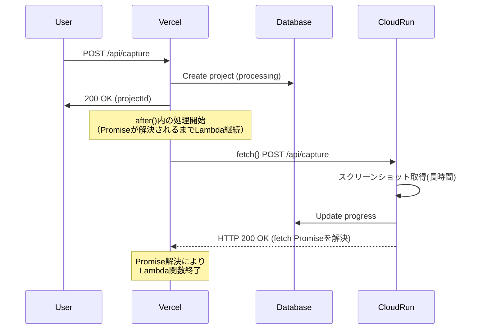

## はじめに

Next.js 15で導入された`after()`は、サーバーレス環境でのバックグラウンド処理を簡潔に実装できる新機能です。本記事では、`after()`の仕組み、従来の`waitUntil()`との違い、そして実際のプロダクション環境での活用方法を詳しく解説します。

## `after()`とは何か

`after()`は、**レスポンス送信後に実行される処理を登録する**ためのAPIです。ユーザーへのレスポンスをブロックせずに、ログ記録、分析、キャッシュ更新などの副作用処理を実行できます。

### 基本的な使い方

```typescript
import { after } from 'next/server'

export async function POST(request: Request) {
  // メインの処理
  const result = await processRequest(request)

  // レスポンス後に実行される処理
  after(async () => {
    await logAnalytics(result)
    await updateCache(result)
  })

  // ユーザーには即座にレスポンス
  return Response.json({ success: true })
}
```

## サーバーレス環境の課題

まず、なぜ`after()`が必要なのかを理解するために、サーバーレス環境の特性を見てみましょう。

### Lambda関数のライフサイクル問題

Vercelなどのサーバーレス環境では、内部的にAWS Lambdaが使われています。Lambda関数には、以下の特性があります：

1. **レスポンス返却と同時に終了する可能性がある**
2. **実行中の非同期処理が強制終了される**
3. **タイムアウト制限がある**（Vercel Hobbyプランは10秒）

```typescript
// ❌ 問題のあるコード
export async function POST(request: Request) {
  // 非同期でログを送信
  fetch('https://analytics.example.com/log', {
    method: 'POST',
    body: JSON.stringify({ event: 'user_action' })
  }).catch(err => console.error(err))

  // すぐにレスポンスを返す
  return Response.json({ success: true })
  // ← Lambda終了！fetchが完了する前に終了する可能性が高い
}
```

このコードの問題点：
- `fetch()`は非同期で実行される
- `Response.json()`を返した瞬間、Lambda関数が終了する
- fetchリクエストが送信される前に関数が終了してしまう

## `waitUntil()`：エッジプラットフォーム共通のプリミティブ

`waitUntil()`は、サーバーレス・エッジプラットフォームで広く採用されている**標準的なパターン**です。Cloudflare Workers、Deno Deploy、Fastly Compute、そしてVercelなど、多くのプラットフォームが同様のAPIを提供しています。

これは元々Service Worker APIの`event.waitUntil()`から派生した概念で、**FetchEvent lifecycle extension**として知られています。

### プラットフォームごとのwaitUntil()

各プラットフォームで提供されていますが、**アクセス方法が異なります**：

#### Vercel

```typescript
export async function POST(request: Request) {
  const fetchPromise = fetch('https://analytics.example.com/log', {
    method: 'POST',
    body: JSON.stringify({ event: 'user_action' })
  })

  // Vercelではrequestオブジェクトからアクセス
  if (request.waitUntil) {
    request.waitUntil(fetchPromise)
  }

  return Response.json({ success: true })
}
```

#### Cloudflare Workers

```typescript
export default {
  async fetch(request: Request, env: Env, ctx: ExecutionContext) {
    const fetchPromise = fetch('https://analytics.example.com/log', {
      method: 'POST',
      body: JSON.stringify({ event: 'user_action' })
    })

    // Cloudflareではcontextオブジェクトからアクセス
    ctx.waitUntil(fetchPromise)

    return Response.json({ success: true })
  }
}
```

#### Deno Deploy

```typescript
Deno.serve(async (request) => {
  const fetchPromise = fetch('https://analytics.example.com/log', {
    method: 'POST',
    body: JSON.stringify({ event: 'user_action' })
  })

  // Deno DeployでもwaitUntilが利用可能
  // (実装は環境により異なる)

  return Response.json({ success: true })
})
```

### waitUntil()の特徴

- ✅ サーバーレス関数の終了を遅らせる
- ✅ 渡されたPromiseが完了するまで関数を維持
- ⚠️ **アクセス方法がプラットフォームごとに異なる**
- ❌ Next.jsのAPIと統合されていない
- ❌ プラットフォーム間の移植性が低い

## `after()`：Next.js公式の高レベル抽象化

`after()`は、`waitUntil()`をラップした、Next.js公式の抽象化レイヤーです。

### after()の利点

#### 1. Next.js APIとの統合

```typescript
import { after } from 'next/server'
import { cookies, headers } from 'next/headers'

export async function POST(request: Request) {
  await updateUserData(request)

  // after()の中でNext.js APIが使える！
  after(async () => {
    const userAgent = (await headers()).get('user-agent')
    const sessionId = (await cookies()).get('session-id')?.value

    await logUserAction({
      userAgent,
      sessionId,
      action: 'data_updated'
    })
  })

  return Response.json({ success: true })
}
```

#### 2. プラットフォーム非依存

`after()`は内部でプラットフォームの`waitUntil()`を自動的に使用します。

```typescript
// Next.jsが内部で行っていること（イメージ）
export function after(callback: () => Promise<void>) {
  const promise = callback()

  // Vercelの場合
  if (platform === 'vercel') {
    request.waitUntil(promise)
  }
  // Cloudflare Workersの場合
  else if (platform === 'cloudflare') {
    context.waitUntil(promise)
  }
  // その他のプラットフォーム
  else {
    // フォールバック処理
  }
}
```

#### 3. エラーハンドリング

`after()`内でエラーが発生しても、メインのレスポンスには影響しません。

```typescript
export async function POST(request: Request) {
  const result = await processRequest()

  after(async () => {
    try {
      await sendEmail(result) // これが失敗しても...
    } catch (error) {
      console.error('Email failed:', error)
    }
  })

  // ユーザーには成功レスポンスが返る
  return Response.json({ success: true })
}
```

#### 4. レスポンス失敗時も実行される

```typescript
export async function POST(request: Request) {
  after(async () => {
    // notFound()やredirect()が呼ばれても実行される
    await logRequest(request)
  })

  if (!isValid(request)) {
    notFound() // after()は実行される
  }

  return Response.json({ success: true })
}
```

## waitUntil() vs after()：詳細比較

| 特徴 | `waitUntil()` | `after()` |
|------|---------------|-----------|
| **レベル** | 低レベルプリミティブ | 高レベル抽象化 |
| **提供元** | 各プラットフォーム（Vercel, Cloudflare等） | Next.js（フレームワーク） |
| **プラットフォーム依存** | あり（アクセス方法が異なる） | なし（自動検出） |
| **Next.js API** | 使えない | 使える（cookies, headers等） |
| **エラーハンドリング** | 手動 | 自動 |
| **タイプセーフ** | 環境依存 | 完全 |
| **移植性** | 低い | 高い |
| **使用可能な場所** | Route Handlers | Server Components, Actions, Route Handlers, Middleware |

## 実践例：外部API呼び出し

### シナリオ：スクリーンショット取得サービス

Vercel（10秒制限）からCloud Run（制限なし）に処理を委譲する実装例です。

#### ❌ 問題のあるコード

```typescript
export async function POST(request: NextRequest) {
  // データベースに処理中として記録
  const project = await createProject()

  // Cloud Runに非同期リクエスト
  fetch('https://cloud-run.example.com/api/capture', {
    method: 'POST',
    body: JSON.stringify({ projectId: project.id })
  })
    .then(res => console.log('Success'))
    .catch(err => console.error('Error'))

  // すぐにレスポンス
  return NextResponse.json({ projectId: project.id })
  // ← Lambda終了！fetchが届かない可能性
}
```

#### ✅ after()を使った正しい実装

```typescript
import { NextRequest, NextResponse, after } from 'next/server'

export async function POST(request: NextRequest) {
  const project = await createProject()

  // after()でレスポンス後も処理を継続
  after(async () => {
    try {
      const response = await fetch('https://cloud-run.example.com/api/capture', {
        method: 'POST',
        headers: {
          'Content-Type': 'application/json',
          'Authorization': `Bearer ${token}`
        },
        body: JSON.stringify({
          projectId: project.id,
          options: { device: 'desktop' }
        })
      })

      if (!response.ok) {
        // エラー時はデータベースを更新
        await updateProjectStatus(project.id, 'error')
      }
    } catch (error) {
      console.error('Cloud Run request failed:', error)
      await updateProjectStatus(project.id, 'error')
    }
  })

  // ユーザーには即座にレスポンス
  return NextResponse.json({
    projectId: project.id,
    status: 'processing'
  })
}
```

### 動作フロー



## 実践例：ログと分析

### セッション情報を含むログ記録

```typescript
import { after } from 'next/server'
import { cookies, headers } from 'next/headers'

export async function POST(request: Request) {
  const body = await request.json()
  const result = await updateUserProfile(body)

  // レスポンス後にログ記録
  after(async () => {
    const userAgent = (await headers()).get('user-agent')
    const sessionCookie = (await cookies()).get('session-id')?.value
    const ip = (await headers()).get('x-forwarded-for')

    await sendToAnalytics({
      event: 'profile_updated',
      userId: result.userId,
      userAgent,
      sessionId: sessionCookie,
      ip,
      timestamp: new Date().toISOString()
    })
  })

  return Response.json({ success: true, userId: result.userId })
}
```

## 実践例：キャッシュの無効化

### データ更新後のキャッシュ更新

```typescript
import { after } from 'next/server'
import { revalidateTag } from 'next/cache'

export async function PUT(request: Request) {
  const data = await request.json()
  await updateProduct(data)

  // レスポンス後にキャッシュを更新
  after(async () => {
    // Next.jsのキャッシュを再検証
    revalidateTag(`product-${data.id}`)

    // 外部キャッシュも更新
    await fetch('https://cdn.example.com/purge', {
      method: 'POST',
      body: JSON.stringify({ keys: [`product-${data.id}`] })
    })
  })

  return Response.json({ success: true })
}
```

## 実践例：メール送信

### Server Actionでのメール送信

```typescript
'use server'

import { after } from 'next/server'

export async function submitContactForm(formData: FormData) {
  // データベースに保存
  const contact = await saveContactForm({
    name: formData.get('name'),
    email: formData.get('email'),
    message: formData.get('message')
  })

  // レスポンス後にメール送信
  after(async () => {
    await sendEmail({
      to: 'support@example.com',
      subject: 'New Contact Form Submission',
      body: `
        Name: ${contact.name}
        Email: ${contact.email}
        Message: ${contact.message}
      `
    })

    // 確認メールも送信
    await sendEmail({
      to: contact.email,
      subject: 'Thank you for contacting us',
      body: 'We received your message and will respond soon.'
    })
  })

  return { success: true, id: contact.id }
}
```

## 使用可能な場所

`after()`は以下の場所で使用できます：

### 1. Route Handlers

```typescript
// app/api/users/route.ts
import { after } from 'next/server'

export async function POST(request: Request) {
  after(async () => {
    await logEvent('user_created')
  })
  return Response.json({ success: true })
}
```

### 2. Server Actions

```typescript
// app/actions.ts
'use server'
import { after } from 'next/server'

export async function updateUser(data: FormData) {
  after(async () => {
    await revalidateCache()
  })
  return { success: true }
}
```

### 3. Server Components

```typescript
// app/page.tsx
import { after } from 'next/server'

export default async function Page() {
  const data = await getData()

  after(async () => {
    await prefetchRelatedData()
  })

  return <div>{data.title}</div>
}
```

### 4. Middleware

```typescript
// middleware.ts
import { after } from 'next/server'
import type { NextRequest } from 'next/server'

export function middleware(request: NextRequest) {
  after(async () => {
    await logRequest(request)
  })

  return NextResponse.next()
}
```

## パフォーマンスへの影響

### タイムアウト設定

`after()`内の処理は、ルートの`maxDuration`設定に従います。

```typescript
// app/api/capture/route.ts
export const maxDuration = 30 // 秒

export async function POST(request: Request) {
  after(async () => {
    // 最大30秒まで実行可能
    await longRunningTask()
  })

  return Response.json({ success: true })
}
```

### コスト考慮

`after()`を使用すると、Lambda関数の実行時間が延びるため、コストが増加する可能性があります。

```typescript
// ❌ コストが高い
export async function POST(request: Request) {
  after(async () => {
    // 不要に長い処理
    await sleep(25000) // 25秒待機
    await simpleLog()
  })

  return Response.json({ success: true })
}

// ✅ コスト効率的
export async function POST(request: Request) {
  after(async () => {
    // 必要最小限の処理
    await simpleLog() // 数ミリ秒
  })

  return Response.json({ success: true })
}
```

## よくあるユースケース

### 1. 分析とトラッキング

```typescript
after(async () => {
  await trackEvent({
    event: 'purchase_completed',
    value: orderTotal,
    userId: user.id
  })
})
```

### 2. 外部通知

```typescript
after(async () => {
  await sendSlackNotification({
    channel: '#orders',
    message: `New order: ${orderId}`
  })
})
```

### 3. データ同期

```typescript
after(async () => {
  await syncToDataWarehouse({
    table: 'users',
    data: updatedUser
  })
})
```

### 4. サムネイル生成

```typescript
after(async () => {
  await generateThumbnails({
    imageId: uploadedImage.id,
    sizes: [100, 200, 400]
  })
})
```

## アンチパターン

### ❌ 重要な業務ロジックを入れる

```typescript
// ダメな例
export async function POST(request: Request) {
  const order = await createOrder()

  after(async () => {
    // 在庫を減らす重要な処理をafter()に入れている
    await decrementInventory(order.items)
  })

  return Response.json({ orderId: order.id })
}
```

**問題点**：`after()`内の処理が失敗しても、ユーザーには成功レスポンスが返ってしまう。

**解決策**：重要な処理はメインフローで実行する。

```typescript
// 良い例
export async function POST(request: Request) {
  const order = await createOrder()

  // 重要な処理はメインフロー
  await decrementInventory(order.items)

  // 副作用的な処理だけafter()
  after(async () => {
    await sendConfirmationEmail(order)
  })

  return Response.json({ orderId: order.id })
}
```

### ❌ データベーストランザクションをまたぐ

```typescript
// ダメな例
export async function POST(request: Request) {
  const transaction = await db.transaction()

  try {
    await transaction.createUser()

    after(async () => {
      // トランザクションがすでにコミット/ロールバックされている
      await transaction.createProfile()
    })

    await transaction.commit()
  } catch (error) {
    await transaction.rollback()
  }
}
```

### ❌ 長時間の処理

```typescript
// ダメな例
export async function POST(request: Request) {
  after(async () => {
    // 30秒以上かかる処理
    await processLargeVideo() // maxDurationを超える
  })

  return Response.json({ success: true })
}
```

**解決策**：長時間処理はバックグラウンドジョブシステム（Vercel Cron、BullMQ等）を使う。

## まとめ

### after()を使うべき場面

- ✅ ログ記録、分析イベント送信
- ✅ キャッシュの無効化・更新
- ✅ メール送信、通知
- ✅ 外部APIへのWebhook送信
- ✅ サムネイル生成などの後処理

### waitUntil()を使うべき場面

- ✅ Next.js以外のフレームワークを使用している
- ✅ Vercel固有の機能に依存する必要がある
- ✅ より低レベルな制御が必要

### どちらも使わない方がいい場面

- ❌ 重要な業務ロジック
- ❌ データベーストランザクション
- ❌ 30秒以上かかる長時間処理
- ❌ ユーザーが結果を待つ必要がある処理

## 参考リンク

- [Next.js 15 - after() API Reference](https://nextjs.org/docs/app/api-reference/functions/after)
- [Vercel - waitUntil Changelog](https://vercel.com/changelog/waituntil-is-now-available-for-vercel-functions)
- [Next.js 15.1 Release Notes](https://nextjs.org/blog/next-15-1)

---

Next.js 15の`after()`は、サーバーレス環境でのバックグラウンド処理を簡単かつ確実に実装できる強力な機能です。適切に使用することで、ユーザー体験を損なうことなく、必要な副作用処理を実行できます。